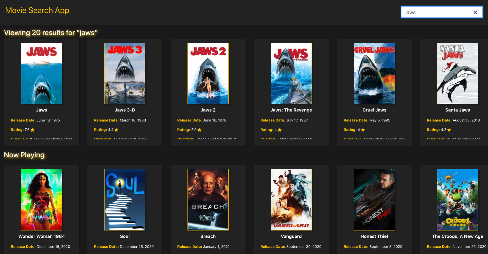
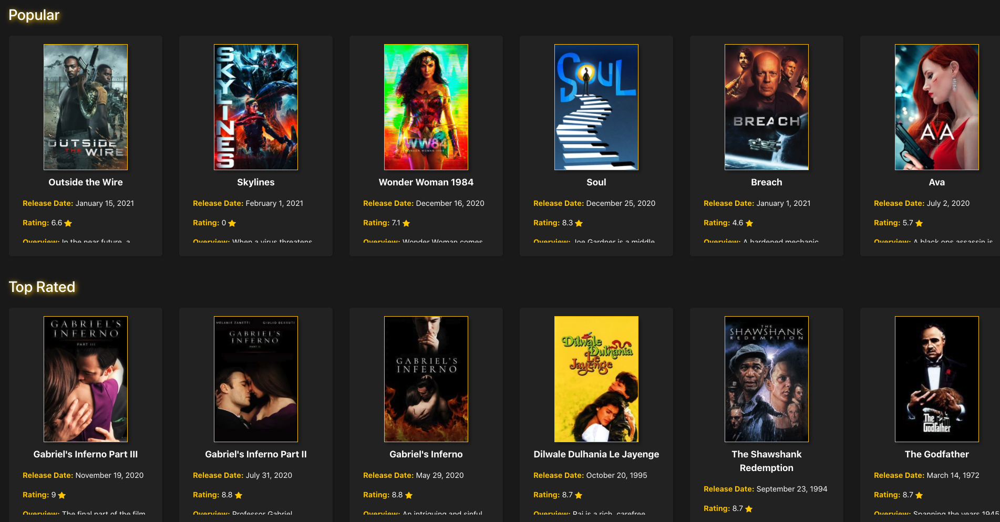

# React Movie App 

## Description 
This is an application using React as the framework and allows the user to search movies they want to watch from the MovieDB API. 

## Installation 
No installation, this application is to be used on the browser. 

## Usage 
This application will allow users to search for movies and will be able to click on them to view their MovieDB page. 
Please view deployed application on [Github Pages](https://nicolewallace09.github.io/react-movie-app/)
 
 

## Tests
No tests are used in this application.

#@gmail# Questions

If you have any questions about this projects, please contact me directly at abhisheksingh246786@gmail.com. You can view more of my projects at https://github.com/abhi246786. 
